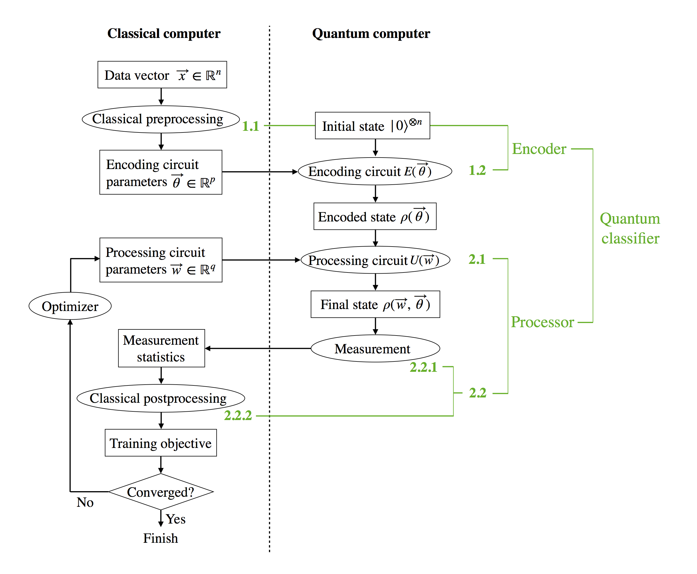

Welcome to the Docs for QClassify!
==================================

QClassify is a Python framework for implementing variational quantum classifiers. The goal is to provide a generally customizable way of performing classification tasks using gate-model quantum devices. The quantum devices can be either simulated by a quantum simulator or a cloud-based quantum processor accessible via Rigetti Computing's `Quantum Cloud Services <https://www.rigetti.com/qcs>`__.

Variational quantum classification is a paradigm of supervised quantum machine learning that has been investigated actively in the quantum computing community (See for instance `Farhi and Neven <https://arxiv.org/abs/1802.06002>`__, `Schuld et al. <https://arxiv.org/abs/1804.00633>`__, `Mitarai et al. <https://arxiv.org/abs/1803.00745>`__ and `Havlicek et al. <https://arxiv.org/abs/1804.11326>`__). The general framework adopted in the design of QClassify follows from these contributions in the literature.

The workflow can be summarized in Figure 1:

*Figure 1: Diagram illustrating the workflow of QClassify. Each rectangle represents a data object and each oval represents a method.* 

Contents
--------

.. toctree::
   :maxdepth: 3

   intro
   vqc_description

Indices and tables
------------------

* :ref:`genindex`
* :ref:`modindex`
* :ref:`search`
